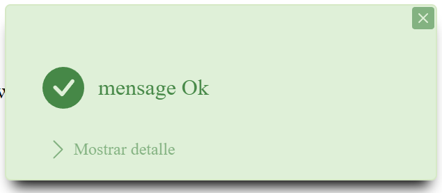

# Plugin Message
### Version : 1.0
### Autor : Carlos Mejía

## Archivos Requeridos
### Message <a href="https://codeload.github.com/paramo18/Message/zip/refs/heads/main/Message.js" download>Download .zip</a>
```html                           
<script type="text/javascript" src="Message\Message.js"></script>
<link rel="stylesheet" href="Message\Message.css">
``` 
```html                           
<link rel="stylesheet" href="Message\Message.css">
<script type="text/javascript" src="Message\Message.js"></script>
``` 


### FlashModal <a href="https://codeload.github.com/paramo18/Message/zip/refs/heads/main/Message.js" download>Download .zip</a>
```html                           
<script type="text/javascript" src="Message\Message.js"></script>
<link rel="stylesheet" href="FlashModal\FlashModal.css">
``` 
```html                           
<link rel="stylesheet" href="Message\Message.css">
<script type="text/javascript" src="FlashModal\FlashModal.js"></script>
``` 

## Usabilidad
### Tipos de Mensaje
#### Mensaje Exitoso
```javascript
new Message().success("mensaje OK").show();
```

