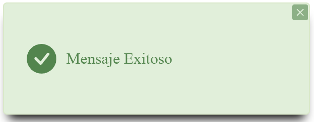

# Plugin Message
| Versión     | Autor       |
| ----------- | ----------- |
| 1.0         | Carlos Mejía|

## Archivos Requeridos
### Message <a href="https://codeload.github.com/paramo18/Message/zip/refs/heads/main" download>Download .zip</a>
```html 
<link rel="stylesheet" href="Message\Message.css">
<script type="text/javascript" src="Message\Message.js"></script>
``` 


### FlashModal <a href="https://codeload.github.com/paramo18/Message/zip/refs/heads/main/Message.js" download>Download .zip</a>
```html    
<link rel="stylesheet" href="FlashModal\FlashModal.css">
<script type="text/javascript" src="Message\Message.js"></script>
``` 

## Usabilidad
### Tipos de Mensaje
#### Mensaje Exitoso
```javascript
new Message().success("Mensaje OK").show();
```


#### Mensaje de Error
```javascript
new Message().error("Mensaje error").show();
```


#### Mensaje de Advertencia
```javascript
new Message().error("Mensaje de advertencia").show();
```

git
