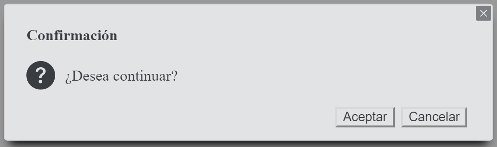

# Plugin Message
| Versión     | Autor       |
| ----------- | ----------- |
| 1.0         | Carlos Mejía|

## Archivos Requeridos
### Message <a href="https://codeload.github.com/paramo18/Message/zip/refs/heads/main" download>Download .zip</a>
```html 
<link rel="stylesheet" href="Message\Message.css">
<script type="text/javascript" src="Message\Message.js"></script>
``` 


### FlashModal <a href="https://codeload.github.com/paramo18/Message/zip/refs/heads/main/Message.js" download>Download .zip</a>
```html    
<link rel="stylesheet" href="FlashModal\FlashModal.css">
<script type="text/javascript" src="Message\Message.js"></script>
``` 

## Usabilidad
### Tipos de Mensaje
#### Mensaje Exitoso
```javascript
new Message().success("Mensaje Exitoso").show();
```


#### Mensaje de Error
```javascript
new Message().error("Mensaje error").show();
```


#### Mensaje de Advertencia
```javascript
new Message().warning("Mensaje de advertencia").show();
```


#### Mensaje Informativo
```javascript
new Message().info("Mensaje Informativo").show();
```


#### Mensaje de Pregunta
```javascript
new Message().question("Mensaje con pregunta").show();
```


### Titulo del Mensaje (setTitle)

```javascript
setTitle(titulo)
```

```javascript
new Message().info("Mensaje Informativo")
             .setTitle("Información")
             .show();
```


### Detalle del Mensaje

```javascript
setDetail(detalle)
```

```javascript
new Message().error("Mensaje de Error")
             .setTitle("Error")
             .setDetail("Detalle del Error.....")
             .show();
```


### Adicionar botones al Mensaje

```javascript
addButton(nombreBoton,metodo)
```

```javascript
new Message().success("Mensaje de Exitoso")
             .setTitle("Existoso")
             .addButton("Aceptar",function(){miMetodoAceptar()})
             .show();
```


### Tamaño del Mensaje

```javascript
setSize(valor)
```

| Tamaño      | Valor (String) |
| ----------- | ------------   |
| muy pequeño | xs             |
| pequeño     | s (Default)    |
| Mediano     | m              |
| Grande      | x              |
| muy grande  | xl             |

```javascript
new Message().warning("Mensaje de Advertencia con tamaño Mediano")
             .setTitle("Advertencia")
             .setSize("m")
             .show();
```


### Posición del Mensaje

```javascript
setPosition(valor)
```

| Posición              | Valor (String)     |
| -----------           | -----------        |
| Arriba a la derecha   | top-right (Default)|
| Arriba en el centro   | top-center         |
| Arriba a la izquierda | top-left           |
| Centro a la derecha   | center-right       |
| Centro                | center             |
| Centro a la izquieda  | center-left        |
| Abajo a la derecha    | bottom-right       |
| Abajo al centro       | bottom-center      |
| Abajo a la izquierda  | bottom-left        |

```javascript
new Message().error("Mensaje de error ubicado en el centro.")
             .setTitle("Error")
             .setPosition("center")
             .show();
```


### Animación del Mensaje

```javascript
setAnimation(valor)
```

| Animación             | Valor (String)  |
| -----------           | ----------------|
| ampliar               | zoom (Default)  |
| Aparecer              | opacity         |
| Desde arriba          | top             |
| Desde la derecha      | right           |
| Desde la izquierda    | left            |
| Desde abajo           | bottom          |

```javascript
new Message().success("Mensaje Exitoso aparece desde la derecha")
             .setTitle("Exitoso")
             .setAnimation("right")
             .show();
```

### Tiempo del Mensaje

```javascript
setTime(segundos)
```

```javascript
new Message().error("Mensaje de Error con tiempo de 5 segundos en Pantalla")
             .setTitle("Error")
             .setTime(5)
             .show();
```

### Mensaje tipo Modal

```javascript
setModal(true)
```

```javascript
new Message().success("Mensaje de Exito con pantalla bloqueada tipo modal")
             .setTitle("Exitoso")
             .setModal(true)
             .show();
```

### Crear Mensaje de confirmación

```javascript
new Message().question("¿Desea continuar?")
             .setTitle("Confirmación")
             .addButton("Aceptar",function(){miMedotoAceptar()})
             .addButton("Cancelar")
             .setPosition("center")
             .setModal(true)
             .setSize("m")
             .show();
```
